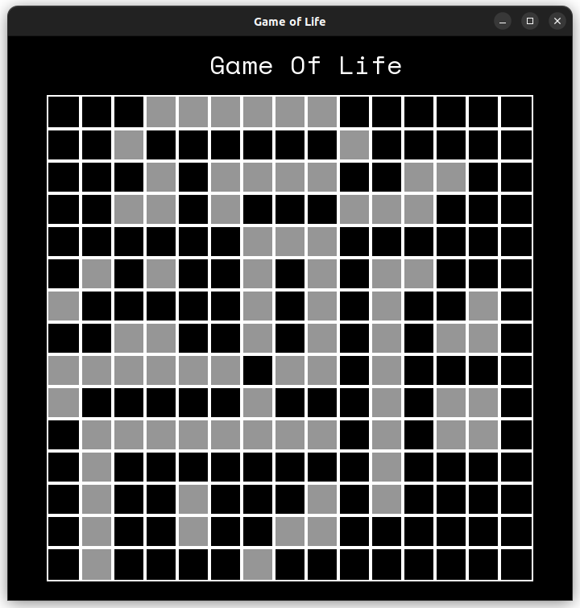

# Game of Life

A simulation based on Conway's Game of Life.
Implemented in C++ using SFML Library.

## Rules

It's an example of Cellular Automata and follows the following rules:

- Any cell with 3 or more neighbors will die (Overpopulation).
- Any cell with 2 or less neighbors will die (Underpopulation).
- Any dead cell with 3 neighbors will come alive (Reproduction).

## Download Instructions

Clone/Download the repo.

`git clone repo`

Execute the run file

`./run`

## Controls

Left Mouse Button - Toggle Cells

P - Pause/Play

C - Clear

R - Randomize

Right Arrow Key - Speed Up

Left Arrow Key - Slow Down
